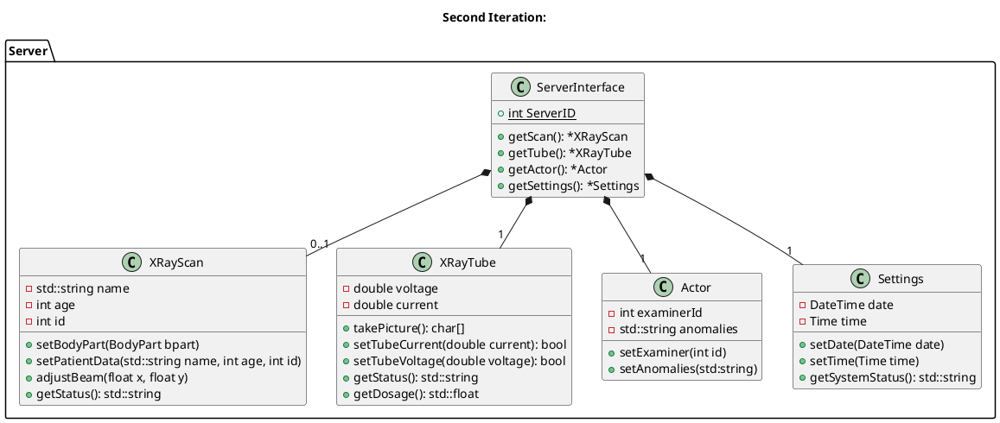

# Issues

1.  `setBodyPart(BodyPart bpart): bool`
    * Sets the body part
    * ?You have to implement an enum which represents the BodyParts?
    * The parameters should be set to the datafield
2.  `setPatientData(PatientData pdata): bool`
    * Sets the patient data
    * ?You have to implement a struct which represents the PatientData?
    * The parameters should be set to the datafield
3.  `adjustBeam(flost x, float y): bool`
    * Adjusts the size of the beam
    * The parameters have to be set to the datafield
4.  `getScanConfig(): xray::Config`
    * Returns the configuation of the set parameters
    * The information about the Patient, the Bodypart and the beam should be collected and    returned
5.  `getDosage(): std::float`
    * Returns the dosage emitted to the patient
    * The dosage is calculated by the following formula: dos=(current + voltage)/2
6.  `setExaminer(int id): bool`
    * Sets the ID of the performing Examiner
    * The parameter should be set to the datafield
7.  `setAnomalies(std:: string): bool`
    * Sets the complications occured during the exam
    * The parameter should be set to the datafield
8.  `getActorConfig(): xray::Config`
    * Returns the configuration of the set parameters
    * The information about the examinerId and the aanomalies should be collected and returned
9.  `setDate(DateTime date): bool`
    * Sets the date
    * ?You have to implement a struct which represents the DateTime?
    * The parameter should be set to the datafield
    `setTime(Time time): bool`
    * Sets the time
    * ?You have to implement a struct which represents the Time?
    * The parameter should be set to the datafield
10. `getSystemStatus(): std::string`
    * Returns the System status
    * The information about the time, date and serverId should be collected and returned

For the next iteration, the server should get an interface, which will be called instead of calling the function directly. The operator of the client should call the interface function for the desired operation and the interface function will handle the data distribution to the base functions.

## Issues #2

1. `getScan(BodyPart bpart, PatientData pdata, float x, float y): std::string`
   * Calls the functions implemented in the first Iteration (Class: XRayScan)
   * returns the results of the getStatus-function
2. `getTube(double voltage, double current): std::string`
   * Calls the functions in the class XRayTube 
   * returns the results of the getStatus-function
3. `getActor(int examinerId, std::string anomalies): std::string`
   * Calls the functions implemented in the first Iteration (Class: Actor)
   * returns the results of the getStatus-function
4. `getSettings(DateTime date, Time time): std::string`
   * Calls the functions implemented in the first Iteration (Class: Settings)
   * returns the results of the getSystemStatus-function
  
After refactoring, the server should look like this.

