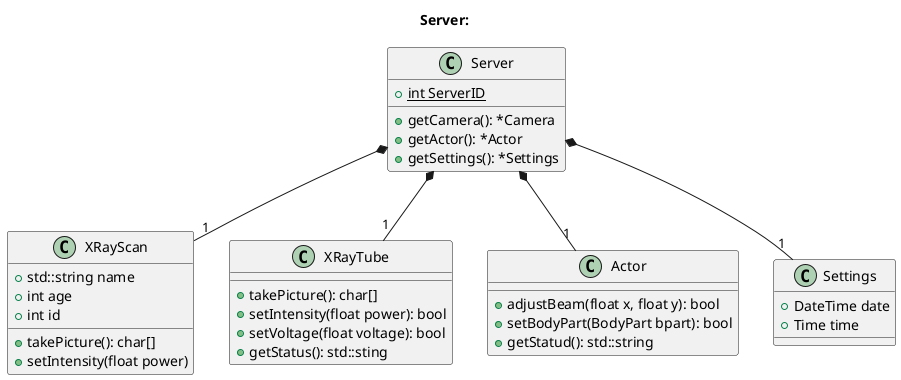
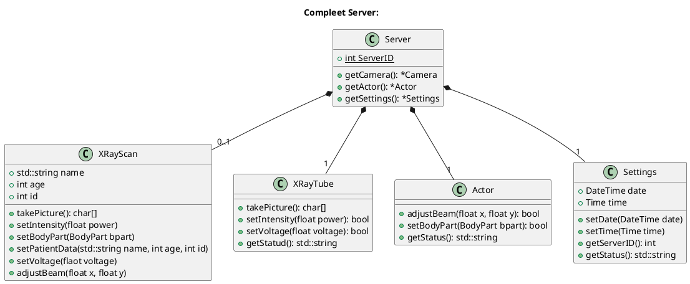

# Workshop

## System

The X-Ray system is built out of two parts. The user interacts with a client software, which is installed on a terminal. The X-Ray is connected to a server, which provides the interface for communicating with the client. This comunication uses the JsonRPC protocol.

```puml
@startuml
!include https://raw.githubusercontent.com/plantuml-stdlib/C4-PlantUML/master/C4_Container.puml
title "Project Structure:"
Person(user, "User")
Container(server, "X-Ray", "Server")
Container(client, "Terminal", "Client")
BiRel_R(server, client, "Comunicate", "JSON")
BiRel_R(client, user, "interacts")
@enduml
```

Currently the system supports two functions. The function `takePicture` and the function `setIntensity`. The function `takePicture` works just fine. Unfortunately, the tests for the function `setIntensity` fails. The following class diagram shows the current structure of the server:



The class `XRayTube` and `Actor` represents components of the X-Ray. They are allready implemented and you should not change them.

TODO: Implement the features and tests. The XRayTube should return a picture. This could take all public members of XRayScan and Settings into account.
TODO: Cheat Sheet C++/JSON/CMake?
TODO: Add client view

## Issues

Your task will be to implement the following features:

1. `setBodyPart(BodyPart bpart)`
    * Sets the body part
    * This interface function passes the value to the Actor
    * If the actor returns false you have to handel the failure
    * ?You have to implement an enum which represents the Body_Parts?
1. `setPatientData(std::string name, int age, int id)`
    * Sets the patient data
    * The parameters have to be set to the datafield
1. `setVoltage(float voltage)`
    * Sets the voltage of the X-Ray tube
    * This interface function passes the value to the XRayTube
    * If the XRayTube returns false you have to handel the failure
1. `setDate(DateTime date)`
    * Sets the date
    * The parameter have to be set to the datafield
1. `setTime(Time time)`
    * Sets the time
    * The parameter have to be set to the datafield
1. `adjustBeam(flost x, float y)`
    * Adjusts the beam
    * The parameters have to be passed to The Actor
    * If the Actor returns false you have to handel the failure
1. `getServerID()`
    * Returns the Id of the instance of the server
1. `getSystemStatus()`
    * Returns the System status
    * The information about the status are collected form the X-Ray tube and the Actor

TODO: Add more features
TODO: Specify the features
TODO: Add complexity?

After you have implemented all features the server should look like this:



## Tasks

1. Setup enviroment
1. Clone and build repro
1. Run the server and get used to the project
1. Run the tests
1. Find and fix the bug in `setIntensity`
1. Hold a team meeting and review issues
1. Organize in teams of two
1. Every team should implement and test one issue
1. Push all features
1. Team meeting and merging of all features
1. eventually develop and implement own feature

TODO: Completet task list and add more details
