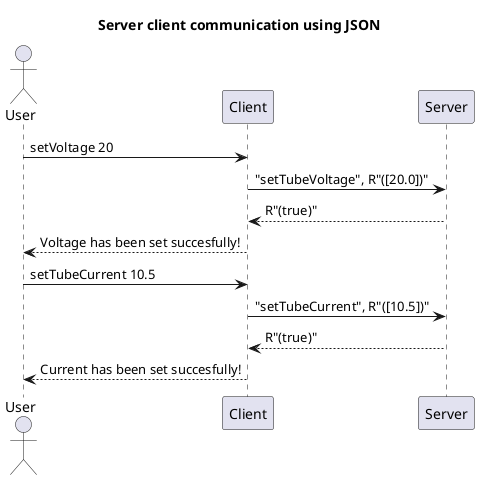
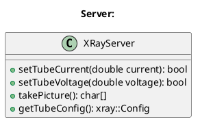
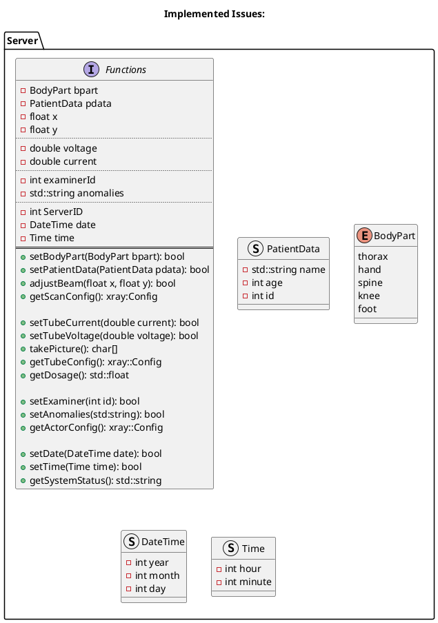

# Workshop

The main goals of the workshop are:

- hands on software development workflow
- continue excisting codbase
- work in small groups
- focus on software development process
- software development is teamwork

TODO: Cheat Sheet C++/JSON/CMake?

## Scope

You are a Software Engineer at ITK.
The Customer "HKO X-ray" has commisioned ITK to develop the software for their new X-ray machine. For this purpose, they have provided the development team with a prototype, which is located here in the test center. The project has been moved from another cpompany to ITK so there is an existig codebase which need to be fixed and extended.

## System Overview

The X-ray machine consists of two hardware components:
    1. Terminal (Client)
    2. X-ray (Server)

```plantuml
@startuml firstServer
!include https://raw.githubusercontent.com/plantuml-stdlib/C4-PlantUML/master/C4_Container.puml
title "Project Structure:"
Person(user, "User")
Container(server, "X-Ray", "Server")
Container(client, "Terminal", "Client")
BiRel_R(server, client, "Comunicate", "JSON")
BiRel_R(client, user, "interacts")
@enduml
```

In this configuration the X-ray acts as a server and the terminal as a client.
The server provides various functions, which can be called by the client. The operator only interacts with the client.

The communication between server and client runs via the JSON-RPC-protocoll.
This sends JSON files back and forth between the server and the client.
As a Request, the client sends a JSON object to the server, in which the function to be called is specified.

As a Response, the server also returns a JSON object. This contains the result of the called function.



Currently the system supports four functions. The functions `takePicture`, `setTubeVoltage`, `setTubeCurrent` and `getTubeConfig`. The following class diagram shows the current structure of the server:



## Sample client server session

To run the server start the server at the terminal with a port number:

```shell
xray-server 4242 
```

On a second terminal you can now send commands from the client to the server using command line arguments:

```shell
xray-client localhost 4242 setTubeCurrent 20
xray-client localhost 4242 setTubeVoltage 20
xray-client localhost 4242 takePicture
```

If everything works properly the output should look like this:

```shell
$xray-client localhost 4242 tubeCurrent 20
Current was set sucessfully!
$xray-client localhost 4242 tubeVoltage 20
Voltage was set sucessfully!
$xray-client localhost 4242 takePicture
This is a picture ;)
```

## Tasks

1. Setup enviroment
1. Clone and build repository
1. Get used to the project: Run client, server and module test
1. Find and fix your first bug
1. Your software development experience: Implement new functionality
    1. Hold a team meeting and review issues
    1. Organize in teams of two
    1. Every team should implement and test one issue
    1. Push all features
    1. Team meeting and merging of all features
    1. eventually develop and implement own feature

## Setup enviroment

To setup your Ubuntu 20.04 machine for building the library execute the following command

```shell
wget -qO - https://raw.githubusercontent.com/a-kuntz/JsonRPC/master/scripts/bootstrap-ubuntu-20-04.sh | sh
```

## Clone and build repository

Clone working copy

```shell
git clone https://github.com/a-kuntz/JsonRPC.git
```

To build the library and run all examples simply run `./build.sh` inside your working copy

```shell
cd JsonRPC
./build.sh
```

## Get used to the project

The build process automaticly runs the included tests. You will see that one test fails. Before you going to find and fix the bug you may want to browse through the code. With the commands above you can also try out the programm and function manually.

## Find and fix your first bug

As you already know there is a bug in the project. Find it and fix it. Therefore you may take a look at the test output. You also can run the single functions manually. You can run the tests without building the whole project by using the following commands:

```shell
cd build
make all test
```
## Implement new functionality

In the GitHub Repo you will find a list of issues. Every issue represents a new feature which should be implemented. Please plan your work together before starting to implement the features. Maybe a team meeting is helpful for this. Please organize in a group of two to implement one issue. Please note that every new feature should be tested sufficent with unit tests. After all features have been implemented the server should look like this:


